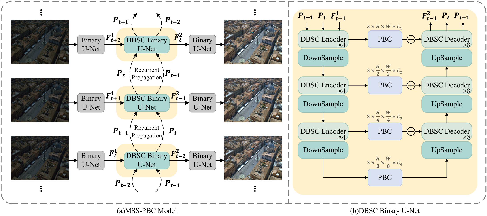

# Motion-Adaptive Soft Shift and Pyramid-Projection Binary Convolution for Low-Light Raw Video Denoising

## 🎥 Demo

<table border="0">
  <tr>
    <td width="50%"></td>
    <td width="50%"></td>
  </tr>
</table>

---

## 📖 Introduction

In this work, we design a binary raw video denoising model (**MSS-PBC**). It can achieve satisfactory results with low memory and computation cost.

<p align="center">
  
</p>

Our MSS-PBC has three main innovations:

* A **Motion-Adaptive Soft Shift (MSS)** operation for content-aware temporal alignment
* A **Pyramid-Projection Binary Convolution (PBC)** for multi-scale context aggregation and magnitude injection
* A **Wavelet-Guided High-Frequency Recovery (WHR)** module for texture and detail restoration


---

## 🛠️ Installation

### Create conda pytorch environment

```bash
conda create -n MSSPBC python=3.7
conda activate MSSPBC
conda install pytorch=1.11 torchvision cudatoolkit=11.3 -c pytorch
```

### Install mmcv

```bash
pip install openmim
mim install mmcv-full==1.6.0
```

### Setup mmedit with MSS-PBC

```bash
git clone https://github.com/tomorrowaa/MSS-PBC.git
cd MSS-PBC
pip install -v -e .
```

### Install dependencies
```bash
pip install -r requirements/brve.txt
```

---

## 💻 Usage

### Prepare Datasets

#### Download datasets

Create the folder to place datasets.

```bash
mkdir datasets
```

The LLRVD dataset can be downloaded from [Baidu Disk](https://pan.baidu.com/s/1b-BU7ZKOm_k7374quZ5Zgw?pwd=xydx#list/path=%2F) (code: xydx).

The ReCRVD dataset can be downloaded from [Baidu Disk](https://pan.baidu.com/share/init?surl=XWn-SFpP2v55Qh-fxQqmQQ) (code: ogyw).

### Test
#### Prepare pretrained models

Create the folder to place pretrained models.

```bash
mkdir pretrained_models
```
The pretrained MSS-PBC models and test video results on LLRVD and ReCRVD datasets can be downloaded from [Baidu Disk](https://pan.baidu.com/s/126pcCVFTvNnhRm9N91Cg6Q ) (code: wjzh).

Put the downloaded pretrained models to `pretrained_models/`

#### Test on the LLRVD dataset

Run the following command to reproduce the results in Table 1.

```bash
python tools/test.py configs/BRVE_LLRVD.py pretrained_models/LLRVD/iter_100000.pth --seed 0 --out test_results/LLRVD/result.json --save-path test_results/LLRVD --gpu-id 0
```
#### Test on the ReCRVD dataset

Run the following command to reproduce the results in Table 2.

```bash
python tools/test.py configs/BRVE_ReCRVD.py pretrained_models/ReCRVD/iter_100000.pth --seed 0 --out test_results/ReCRVD/result.json --save-path test_results/ReCRVD --gpu-id 0
```

### Train
#### Train on the LLRVD dataset

```bash
 python tools/train.py configs/BRVE_LLRVD.py --seed 0 --launcher none
```

#### Train on the ReCRVD dataset

```bash
python tools/train.py configs/BRVE_ReCRVD.py --seed 0 --launcher none
```

---

## 🙏 Acknowledgements

Special thanks to the editors and anonymous reviewers for their time, valuable comments, and insightful suggestions that greatly improved this paper.
